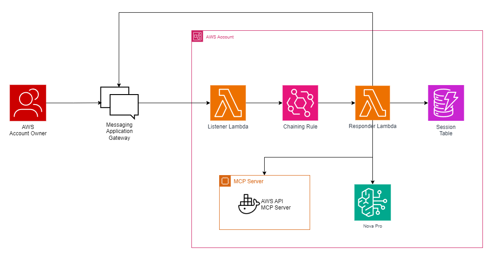

# AWS API MCP Chat Integration

This repository contains a reference implementation for bridging AWS API MCP Server with chat channels such as Telegram and WhatsApp. This is also the prototype that been used as demonstration in my session titled "Chatting with your AWS Infrastructure on-the-go: The Power of AWS API MCP Server" for AWS Community Day Indonesia 2025.

**⚠️ DISCLAIMER ⚠️**<br>
This solution means to demonstrate initial capabilities and not intended for production workload. Certain configurations, such as permissive IAM policies, publicly accessible Lambda Function URLs, and simplified authentication mechanisms, are intentionally relaxed for demonstration purposes and **must be hardened before any production deployment**.



## Getting Started

These instructions help you recreate the sandbox environment, deploy the AWS resources, and connect the chat channels for end-to-end conversations powered by Bedrock.

### Installing and Running

1. **Clone the repository.**
   ```bash
   git clone https://github.com/revawiki/aws-api-mcp-chatbot-integration.git
   cd aws-api-mcp-chatbot-integration
   ```

2. **Provision core AWS resources.**
   - Deploy and provision all AWS resource needed by following the specification guide in `spec/`.
   - This prototype resources are purely provisioned via AWS console, for terraform or aws-cli approach please follow all `spec/` detail.

3. **Details for Lambda environment variables.**
   - `MCP_HOST`: Hostname of the MCP server (EC2 instance).
   - `SESSION_TABLE_NAME`: Name of the DynamoDB table (`wiki-dynamo-sandbox`).
   - `INTEGRATION_AUTH_TOKEN`: A simple bearer token for webhook auth. You can use this [token-generator](https://it-tools.tech/token-generator) or generate locally using cryptic generation.
   - `INTEGRATION_API_TOKEN`: 
     - for **WhatsApp**: Fill with Fonnte device token.
     - for **Telegram**: Fill with Telegram bot token.

4. **Verify Bedrock access.**
   - Confirm the Lambda execution role can invoke the required Bedrock models via the Converse API.
   - Review `spec/iam-role.md` for least-privilege policy guidance.

### Channel Configuration

1. **Telegram Bot**
   - With an active Telegram account, follow guidance on `channel/telegram-bot.md`.
   - Verify the listener Lambda receives inbound messages and that the responder calls Telegram’s sendMessage API.

2. **WhatsApp via Fonnte**
   - Register to Fonnte and follow guidance on `channel/fonnte-whatsapp.md`.
   - Verify the listener Lambda receives inbound messages and that the responder calls Fonnte’s send API.

3. **Event Routing**
   - Ensure EventBridge rules forward listener events (`lambda.telegram.listener`, `lambda.whatsapp.listener`) to the matching responder Lambdas.
   - Validate end-to-end flows through CloudWatch Logs and channel clients.

## Built With

* [Amazon Lambda](https://aws.amazon.com/lambda/) for listener and responder functions.
* [Amazon EventBridge](https://aws.amazon.com/eventbridge/) for message fan-out between listeners and responders.
* [Amazon DynamoDB](https://aws.amazon.com/dynamodb/) for session and state persistence.
* [Amazon Bedrock](https://aws.amazon.com/bedrock/) for generative responses.
* [Amazon EC2](https://aws.amazon.com/ec2/) hosting the MCP server.
* [AWS API MCP Server](https://awslabs.github.io/mcp/servers/aws-api-mcp-server) for FM to communicate with AWS infrastructure.
* [Docker](https://www.docker.com) for running the MCP server locally.

## Credits

* [AWS Labs Team](https://github.com/awslabs/mcp) for a great breakthrough.
* [AWS User Group Indonesia](https://awscommunity.id/) for giving me a chance to share this prototype.

##### Questions / Inquiries
If you have questions about the project, feel free to reach out to `reva.wiki@gmail.com`. Thank you!
